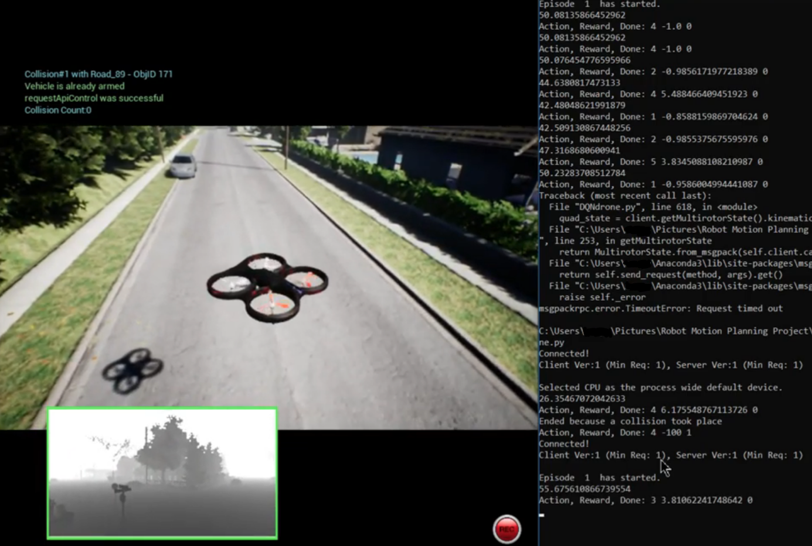

<!-- Main -->

<!-- One -->
<section id="two" class="spotlights">
	<!--Deep Learning for Android-->
	<section>
		

		<figcaption><blockquote>A demo of the deployed app</blockquote></figcaption>
 <!--Add appropriate image/gif (CV)-->
		

			

				<header class="major">
					<h2>Deep Learning for Android <a href="https://sites.google.com/vt.edu/slixstream/home?authuser=0" target="_blank"><i class="fa fa-external-link"></i></a></h2>
					<h4>An App for High Speed Bicyclists</h4>
				</header>
				
An Object Detection Android App deployed onto smartphones to assist bicyclists in slipstreaming. The app detects alert signs on the road and large vehicles such as trucks and buses and draws bounding boxes around the detected objects

				<code>TensorFlow Lite, YOLO Network, Android Studio</code>	
			

		

	</section> 
	<!--Kaggle's Categorical Challenge-->
	<section>
	
 

		

			

				<header class="major"> <!--Include Github link: <a href="#" class="icon fa-github">Github</a> Also put the DA report in the repo!-->
					<h2>Kaggle's Categorical Encoding Challenge</h2>
				</header>
				

					A unique Kaggle challenge to experiment with optimal encoding and data pre-processing techniques for categorical data. Achieved improved regression performance and landed within the top 90 percentile ranks of the leaderboard.
				

				<code>Python, scikit-learn</code>	
			
 <!--Add appropriate Kaggle Image-->
		

	</section>
	<!--Deep Q Network-->
	<section>
		
 
		<figcaption><blockquote>A snapshot of a training episode</blockquote></figcaption>
 <!--Add appropriate Deep Q Image-->
		

			

				<header class="major">
					<h2>Deep Q Learning using Microsoft AirSim <a href="https://sites.google.com/vt.edu/thewolverine/home?authuser=0" target="_blank"><i class="fa fa-external-link"></i></a></h2>
				</header>
				
Designed an optimum navigation policy using Deep Q Learning for a simulated UAV in Microsoft AirSim to reach a goal position. An appropriate reward function was calculated to teach the drone to choose actions to move further towards the goal and to penalise for actions chosen that results in obstacle collisions.

				<code>Microsoft AirSim, Reinforcement Learning</code>	
			

		

	</section>
	<!--Question Answering System-->
	<section>
	

	

		

				
 
					<header class="major"> <!--Include Github link-->
					<h2>VQA System</h2>
					</header>
					
STAR method

					<code>List skills</code>	
				

			

				<header class="major">
					<h2>Technical Portfolio <a href="https://github.com/shalinirago/forty-jekyll-theme/tree/gh-pages-1" class="icon fa-github">Github</a></h2>
				</header>
				
Version 1 of technical portfolio designed.

				<code>HTML/CSS, jQuery, Jekyll Themes</code>
			

		

		

		

	</section>
</section>

